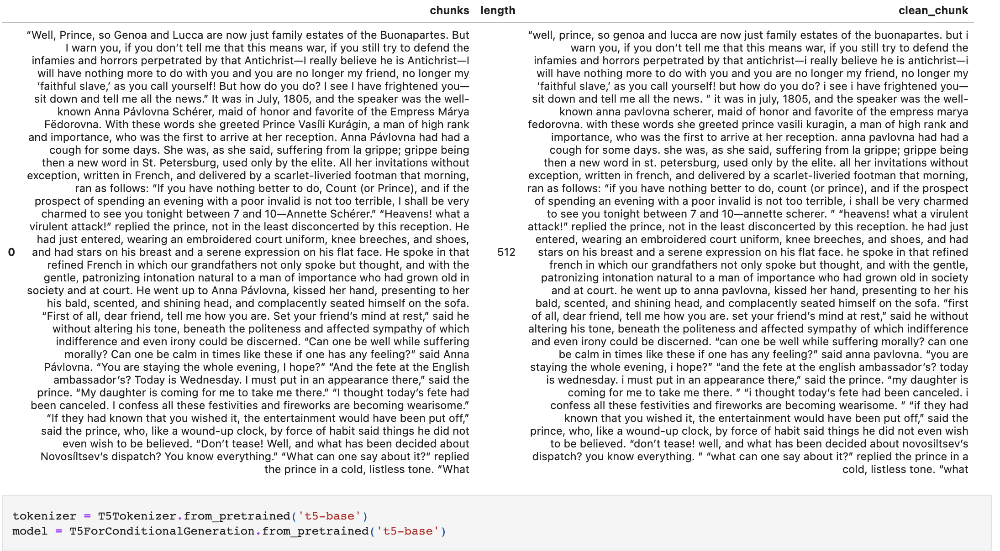
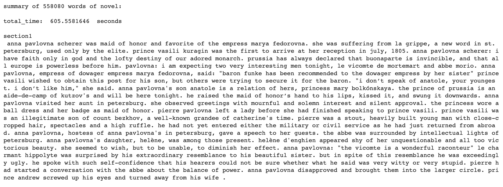

# Novel Abstractive Summarization Techniques
## on a variety of corpora using T5, GPT-[?] and BERT
by Brayton Hall

Table of Contents:

- [Data](#data)

## Motivation
To use state-of-the-art transformers in novel ways, and quite possibly on novels themselves. Specifically, to test the ways in which transformers with many parameters can be fine-tuned with very little labeled data (i.e. few-shot learning), so that a large language model can learn, by itself, to approximate the task of summarizing, for example, the entirety of War and Peace (or any long form document) with output options **along different embeddings** to capture desired themes. The potential of this type of few-shot learning, in conjunction with active learning, is enormous. 
 

## Current basic output: 
Summarization of the entirety of War and Peace with zero-shot chunking summarization. 
### 
### 
